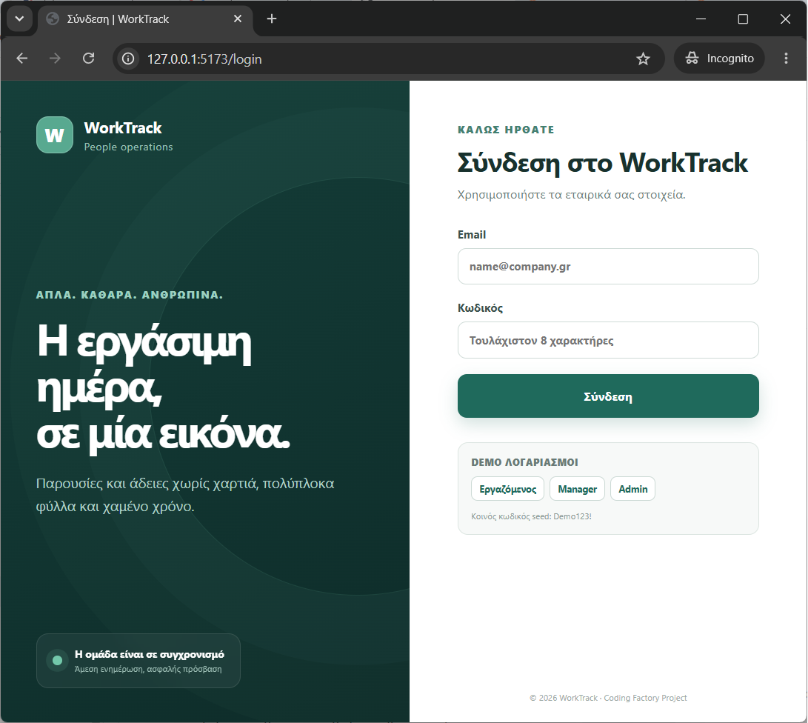
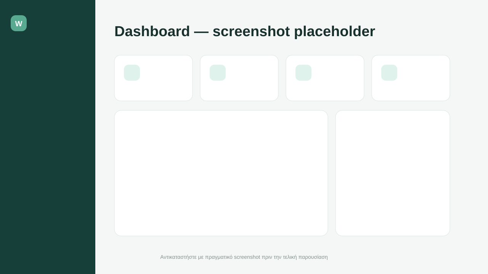
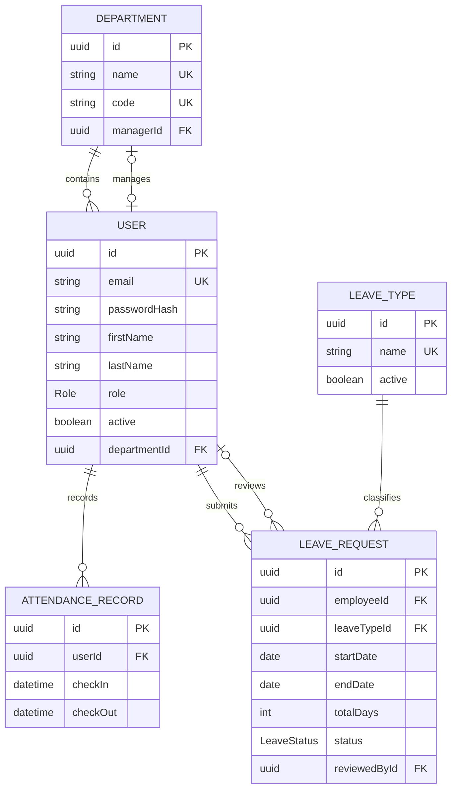

<!--
WorkTrack — Τελικό Project για το Coding Factory του ΚΕΔΙΒΙΜ του ΟΠΑ.
Δημιουργός: Παναγιώτης Κουφουδάκης <pkoufoudakis@outlook.com>.
Φοιτητής στο Τμήμα Ηλεκτρολόγων Μηχανικών & Τεχνολογίας Υπολογιστών του Πανεπιστημίου Πατρών.
-->

# WorkTrack

Το **WorkTrack** είναι ένα ολοκληρωμένο MVP web εφαρμογής για διαχείριση παρουσιών και αδειών εργαζομένων. Αναπτύχθηκε ως τελικό project για το Coding Factory με JavaScript σε όλο το stack: React/Vite στο frontend, Node.js/Express στο backend και PostgreSQL μέσω Prisma ORM.

## Δημιουργός

**Παναγιώτης Κουφουδάκης**  
[pkoufoudakis@outlook.com](mailto:pkoufoudakis@outlook.com)  
Φοιτητής στο Τμήμα Ηλεκτρολόγων Μηχανικών & Τεχνολογίας Υπολογιστών του Πανεπιστημίου Πατρών.

Η εργασία αποτελεί το Τελικό Project για το **Coding Factory του ΚΕΔΙΒΙΜ του Οικονομικού Πανεπιστημίου Αθηνών (ΟΠΑ)**.

> Εκπαιδευτικό project. Δεν περιλαμβάνει μισθοδοσία, βάρδιες, GPS, βιομετρικά ή σύνθετη συσσώρευση υπολοίπων αδείας.

## Εικόνες εφαρμογής

Τα παρακάτω είναι placeholders.

| Σύνδεση | Dashboard |
| --- | --- |
|  |  |


## Τι μπορεί να κάνει

- Ασφαλές login με JWT, bcrypt password hashing και logout στο client.
- Ρόλοι `EMPLOYEE`, `MANAGER`, `ADMIN` με authorization σε κάθε προστατευμένο endpoint.
- Check-in/check-out και προσωπικό ιστορικό παρουσιών.
- Υποβολή και παρακολούθηση αιτημάτων άδειας.
- Έγκριση/απόρριψη μόνο για αιτήματα του τμήματος του manager.
- Admin διαχείριση εργαζομένων, τμημάτων και τύπων αδειών.
- Dashboard με διαφορετικές μετρικές και ενέργειες ανά ρόλο.
- Zod server-side validation, ενιαία JSON errors και rate limiting στο authentication.
- Swagger/OpenAPI documentation.
- Idempotent seed με αποκλειστικά δοκιμαστικούς λογαριασμούς.
- Unit και HTTP integration tests με Vitest/Supertest.
- Responsive ελληνικό UI για desktop, tablet και κινητό.

## Αρχιτεκτονική

Το backend ακολουθεί αυστηρά τη ροή:

```text
HTTP Request
    ↓
Routes → authentication / validation / role guard
    ↓
Controller → μετατροπή HTTP request/response
    ↓
Service → business rules και authorization ανά πόρο
    ↓
Repository → αποκλειστική πρόσβαση μέσω Prisma
    ↓
Domain Model → User, Department, AttendanceRecord, LeaveRequest, LeaveType
    ↓
PostgreSQL
```

Οι route guards εμποδίζουν πρόσβαση σε λάθος ρόλο, ενώ τα services κάνουν τον κρίσιμο έλεγχο σε επίπεδο συγκεκριμένου record (π.χ. το αίτημα πρέπει να ανήκει στο τμήμα του manager). Το frontend κρύβει μη διαθέσιμες επιλογές για καλύτερο UX, αλλά δεν θεωρείται όριο ασφαλείας.

## Domain model



## Δομή project

```text
worktrack/
├── backend/
│   ├── prisma/                 # schema, SQL migration, ασφαλές seed
│   ├── src/
│   │   ├── domain/             # domain models
│   │   ├── repositories/       # Prisma data access
│   │   ├── services/           # business logic και record-level checks
│   │   ├── controllers/        # HTTP adapters
│   │   ├── routes/             # REST routes και role guards
│   │   ├── middleware/         # JWT, validation, error handling
│   │   ├── validation/         # Zod schemas
│   │   └── config/             # env, Prisma, OpenAPI
│   └── test/                   # unit/integration tests
├── frontend/
│   └── src/                    # React SPA, pages, components, API client
├── docs/screenshots/           # placeholders παρουσίασης
├── docker-compose.yml          # PostgreSQL 16
├── pnpm-workspace.yaml         # monorepo workspaces
└── .env.example
```

## Προαπαιτούμενα

1. **Node.js 20 LTS ή νεότερο**.
2. **pnpm 11**: `npm install --global pnpm@11.19.0`.
3. **Docker Desktop** με ενεργό Docker Compose.
4. Προαιρετικά Git.

Ελέγξτε την εγκατάσταση:

```bash
node --version
pnpm --version
docker --version
docker compose version
```

## Εγκατάσταση βήμα προς βήμα

Από τον κεντρικό φάκελο `worktrack`:

```bash
pnpm install
```

Δημιουργήστε το αρχείο ρυθμίσεων του backend.

Windows PowerShell:

```powershell
Copy-Item .env.example backend/.env
```

macOS/Linux:

```bash
cp .env.example backend/.env
```

Το `.env.example` περιέχει μόνο ασφαλείς development τιμές. Για πραγματική εγκατάσταση αλλάξτε οπωσδήποτε το `JWT_SECRET` με τυχαία τιμή τουλάχιστον 32 χαρακτήρων. Μην κάνετε commit το `backend/.env`.

## Βάση, migration και seed

Εκκινήστε την PostgreSQL:

```bash
docker compose up -d postgres
docker compose ps
```

Εφαρμόστε το υπάρχον migration και φορτώστε demo δεδομένα:

```bash
pnpm --dir backend prisma:generate
pnpm --dir backend prisma:deploy
pnpm db:seed
```

Για ανάπτυξη νέου migration μετά από αλλαγή στο `schema.prisma`:

```bash
pnpm db:migrate -- --name descriptive_change_name
```

Για πλήρη επαναφορά της development βάσης (διαγράφει τα τοπικά δεδομένα):

```bash
docker compose down -v
docker compose up -d postgres
pnpm --dir backend prisma:deploy
pnpm db:seed
```

## Εκτέλεση development

Με μία εντολή εκκινούν frontend και backend:

```bash
pnpm dev
```

- UI: <http://localhost:5173>
- REST API: <http://localhost:3001/api>
- Swagger UI: <http://localhost:3001/api-docs>
- OpenAPI JSON: <http://localhost:3001/openapi.json>
- Health check: <http://localhost:3001/health>

Εναλλακτικά, σε δύο terminals:

```bash
pnpm dev:backend
pnpm dev:frontend
```

## Δοκιμαστικοί λογαριασμοί seed

Αυτοί οι λογαριασμοί υπάρχουν **μόνο για local demo**. Όλοι χρησιμοποιούν τον κωδικό `Demo123!`.

| Ρόλος | Email |
| --- | --- |
| Employee | `employee@worktrack.local` |
| Manager | `manager@worktrack.local` |
| Admin | `admin@worktrack.local` |

Το seed κάνει bcrypt hash πριν γράψει τον κωδικό στη βάση και είναι idempotent, οπότε μπορεί να εκτελεστεί ξανά χωρίς διπλές βασικές εγγραφές. Μην χρησιμοποιήσετε αυτά τα credentials εκτός development.

## Tests και έλεγχοι

```bash
# 13 unit/integration tests
pnpm test

# tests με HTML/text coverage report
pnpm test:coverage

# production frontend build
pnpm build

# έλεγχος Prisma schema
pnpm --dir backend exec prisma validate
```

Τα tests καλύπτουν check-in/check-out invariants, υπολογισμό ημερών και overlaps άδειας, manager department isolation, self-review prevention, JWT protection, role guards, validation errors, health endpoint και 404 response shape.

## REST API (σύνοψη)

| Μέθοδος | Endpoint | Πρόσβαση |
| --- | --- | --- |
| `POST` | `/api/auth/login` | Public |
| `GET` | `/api/auth/me` | Authenticated |
| `POST` | `/api/attendance/check-in` | Authenticated |
| `POST` | `/api/attendance/check-out` | Authenticated |
| `GET` | `/api/attendance/mine` | Authenticated |
| `POST` | `/api/leaves` | Authenticated |
| `GET` | `/api/leaves/mine` | Authenticated |
| `GET` | `/api/leaves/department` | Manager/Admin |
| `PATCH` | `/api/leaves/:id/status` | Manager/Admin + department check |
| `GET/POST/PATCH` | `/api/admin/users` | Admin |
| `GET/POST/PATCH/DELETE` | `/api/admin/departments` | Admin |
| `GET/POST/PATCH` | `/api/admin/leave-types` | Admin |

Για bodies, response examples και δοκιμή requests, ανοίξτε το Swagger UI.

## Production build και deployment

1. Ορίστε production `DATABASE_URL`, ισχυρό `JWT_SECRET`, σωστό `CLIENT_URL` και `NODE_ENV=production` στο hosting environment.
2. Εγκαταστήστε μόνο από το lockfile: `pnpm install --frozen-lockfile`.
3. Δημιουργήστε Prisma client: `pnpm --dir backend prisma:generate`.
4. Εφαρμόστε migrations χωρίς interactive prompts: `pnpm --dir backend prisma:deploy`.
5. Χτίστε το frontend: `pnpm build`. Το αποτέλεσμα βρίσκεται στο `frontend/dist`.
6. Εκκινήστε το API: `pnpm --dir backend start`.
7. Σερβίρετε το `frontend/dist` από static host/CDN και κάντε reverse proxy το `/api` προς το backend. Εναλλακτικά ορίστε `VITE_API_URL` πριν από το build.
8. Τερματίστε TLS/HTTPS στο reverse proxy ή στην πλατφόρμα hosting. Μη χρησιμοποιείτε τους seed users σε production.

Παράδειγμα build με διαφορετικό API URL:

```bash
VITE_API_URL=https://api.example.com/api pnpm build
```

## Security notes

- Passwords αποθηκεύονται μόνο ως bcrypt hashes (cost 12).
- JWTs λήγουν σε 8 ώρες από προεπιλογή και δεν περιέχουν ευαίσθητα στοιχεία.
- Το API επανελέγχει ότι ο χρήστης είναι ενεργός σε κάθε authenticated request.
- Το Express κρύβει το `x-powered-by`, χρησιμοποιεί Helmet, περιορισμένο CORS και body size limit.
- Τα Prisma queries είναι parameterized. Η Zod απορρίπτει άγνωστους/λανθασμένους τύπους εισόδου.
- Το logout αφαιρεί το stateless access token από τον client. Για production σύστημα υψηλότερων απαιτήσεων προτείνεται refresh-token rotation/revocation ή short-lived access tokens με httpOnly cookies.

## Συχνά προβλήματα

- **`P1001: Can't reach database server`**: βεβαιωθείτε ότι το Docker Desktop τρέχει και ότι το `docker compose ps` δείχνει healthy PostgreSQL.
- **Port 5432 already in use**: αλλάξτε το host port στο `docker-compose.yml` και το αντίστοιχο port στο `DATABASE_URL`.
- **401 μετά από αλλαγή χρήστη/secret**: κάντε logout ή διαγράψτε το key `worktrack_token` από το browser local storage και συνδεθείτε ξανά.
- **CORS error**: το `CLIENT_URL` πρέπει να είναι ακριβώς το origin του frontend, χωρίς τελικό `/`.

## Git

Το repository μπορεί να αρχικοποιηθεί τοπικά χωρίς απομακρυσμένο publish:

```bash
git init
git add .
git commit -m "Initial WorkTrack MVP"
```
